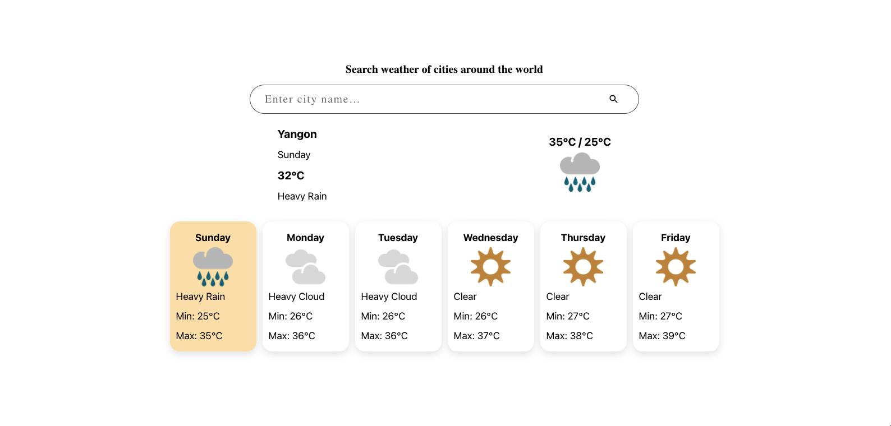
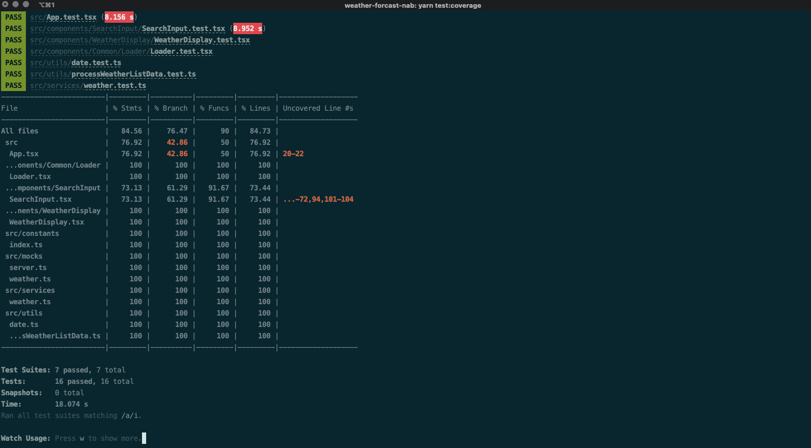

# Built with

- [React](https://reactjs.org/)
- [MetaWeather API](https://www.metaweather.com)
- [Netlify](https://www.netlify.com/)

# View this project on Netlify
- https://musing-lalande-43da5c.netlify.app/
# How to start this project

- Clone this souce code
- Run `yarn install` to install dependencies (you should install correct Node version as specified in the terminal, ep, expected version "^10 || ^12 || >=14". Got "13.11.0)
- Run `yarn start`
- Go to `localhost:3000`

# To run test

### `yarn test`

Launches the test runner in the interactive watch mode.\
See the section about [running tests](https://facebook.github.io/create-react-app/docs/running-tests) for more information.

### `yarn test:coverage`

To see the test coverage

# Preview

# Test coverage

